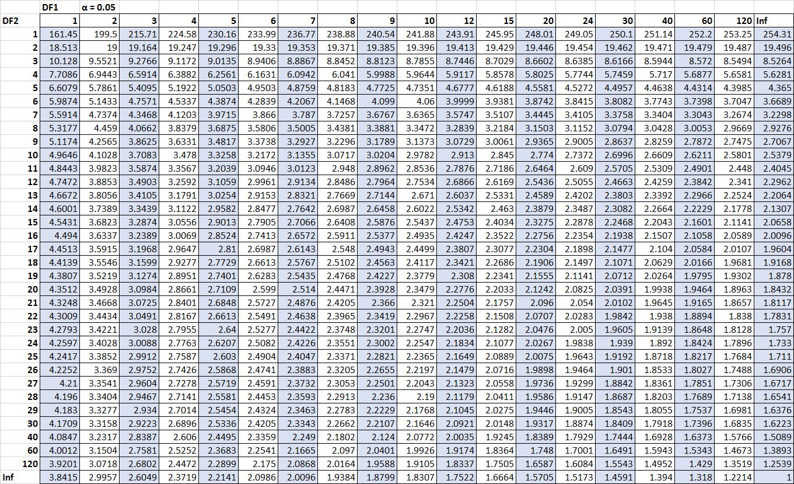

# ANOVA

ANOVA (Analysis of Variance) steht für Analyse der Varianz und ist ein statistisches Verfahren, das verwendet wird, um zu testen, ob es signifikante Unterschiede zwischen den Mittelwerten von mehreren Gruppen gibt.

_Beispiel_  
_Angenommen, du möchtest untersuchen, ob der durchschnittliche Umsatz in drei verschiedenen Filialen unterschiedlich ist. Mit ANOVA kannst du testen, ob die Unterschiede im Umsatz zwischen den Filialen auf echten Unterschieden beruhen oder ob sie durch Zufall entstanden sind._

Beim ANOVA bedienen wir uns des sogenannten F-Tests, bei dem das Verhältnis der Varianz zwischen den Gruppen zur Varianz innerhalb der Gruppen gemessen wird.  
Genau wie bei den Hypothesentest formulieren wir Null- und Alternativhypothesen.

## Einfaktorielles ANOVA

Die Einfaktorielle ANOVA (one-way ANOVA) ist eine spezielle Form der ANOVA, die verwendet wird, um zu testen, ob es signifikante Unterschiede zwischen den Mittelwerten von mehr als zwei Gruppen gibt, wobei nur ein Faktor (eine unabhängige Variable) betrachtet wird.

_Beispiel_  
_Angenommen, du untersuchst den Einfluss von drei verschiedenen Lernmethoden auf die Noten von Schülern. Hier ist die Lernmethode der eine Faktor, der in drei Gruppen (Methoden) unterteilt ist. Das einfaktorielle ANOVA prüft, ob die Noten der Schüler zwischen den drei Gruppen signifikant unterschiedlich sind._  

_Es wird eine Stichprobe aus allen drei Gruppen gezogen, welche misst, wie viele Themen jemand aus der Gruppe pro Woche lernt._

|Buchlerner|Vorlesungslerner|Videolerner|
|-|-|-|
|6|7|7|
|7|8|9|
|8|9|11|

_Nullhypothese: die Mittelwerte der Gruppen sind gleich: alle lernen gleich effektiv $H_0: \mu_1 = \mu_2 = \mu_3$._

_Alternativhypothese: die Mittelwerte der Gruppen unterscheiden sich: die Gruppe lernen unterschiedlich effektiv $H_1: \mu_1 \neq \mu_2 \neq \mu_3$._

- Berechne die Mittelwerte jeder Stichprobe.

$$ \mu_{s1} = \frac{6+7+8}{3} = 7 $$

$$ \mu_{s2} = \frac{7+8+9}{3} = 8 $$

$$ \mu_{s3} = \frac{7+9+11}{3} = 9 $$

- Berechne den Mittelwert der Stichprobenmittelwerte, bzw. den Mittelwert aller 9 Datenpunkte.

$$ \mu_{gesamt} = \frac{7+8+9}{3} = 8 $$

- Berechne jede Differenz zwischen Mittelwert einer Stichprobe und Gesamtmittelwert, bilde das Quadrat der Differenz, multipliziere das Quadrat mit der Anzahl der Datenpunkte pro Stichprobe und bilde schließlich die Summe dieser drei Werte.

$$ SSC = \sum_{i=1}^m n(\mu_i - \mu_{ges})^2 = 3(7-8)^2 + 3(8-8)^2 + 3(9-8)^2 = 6 $$

Diese Summe ist der erste wichtige Wert, den wir uns merken müssen. Wir nennen ihn SSC (sum of squares (columns)).

Als nächstes berechnen wir die Varianzen innerhalb der Gruppen.

|$\sum (x_{1i}-\mu_{s1})^2$|$\sum (x_{2i}-\mu_{s2})^2$|$\sum (x_{3i}-\mu_{s3})^2$|
|-|-|-|
|$(6-7)^2 = 1$|$(7-8)^2 = 1$|$(7-9)^2 = 4$|
|$(7-7)^2 = 0$|$(8-8)^2 = 0$|$(9-9)^2 = 0$|
|$(8-7)^2 = 1$|$(9-8)^2 = 1$|$(11-9)^2 = 4$|
|$\sum = 2$|$\sum = 2$|$\sum = 8$|

Die drei Varianzen summieren wir auf. Das ist der zweite wichtige Wert für ANOVA mit dem Namen SSE (sum of squares (errors)).

$$ SSE = 2+2+8 = 12 $$

SSC und SSE müssen wir nun durch ihre entsprechenden Freiheitsgrade teilen, um zum MSC (mean sum of squares (columns)) und zum MSE (mean sum of squares (errors)) zu gelangen, mit denen wir das sogenannte "f-ratio" berechnen können.

Der Freiheitsgrad $v_1$ des SSC berechnet sich durch die Spaltenanzahl (Anzahl der Gruppen) minus $1$.

$$ v_1 = Spaltenanzahl - 1 $$

Den MSC berechnen wir dann indem wir SSC durch $v_1$ teilen.

$$ MSC = \frac{SSC}{v_1} $$

Der Freiheitsgrad $v_2$ des SSE berechnet sich durch Anzahl aller Datenpunkte minus die Anzahl der Spalten.

$$ v_2 = Anzahl\ Datenpunkte - Anzahl\ Spalten $$

$$ MSE = \frac{SSE}{v_2} $$

Das f-ration erhalten wir dann einfach, indem wir den MSC durch den MSE teilen.

$$ f = \frac{MSC}{MSE} $$

Auf Beispiel bezogen erhalten wir dann folgende Werte:

$$ MSC = \frac{6}{3-1} = 3 $$

$$ MSE = \frac{12}{9-3} = 2 $$

$$ f = \frac{3}{2} $$

Um das f-ratio zu beurteilen, gibt es eine sogenannte F-Verteilung. Diese Verteilung gucken wir uns im folgenden Kapitel genauer an. An dieser Stelle sei schon einmal gesagt, dass man aus der F-Verteilung einen kritischen Wert bekommt, der ähnlich wie das Signifikanzniveau ist. Wenn jetzt unser berechnetes f-ratio größer als dieser kritische Wert ist, dann lehnen wir die Nullhypothese ab. Ist das f-ratio kleiner als der kritische Wert, dann nehmen wir weiterhin die Nullhypothese als wahr an.

## F-Verteilung

Die F-Verteilung ist eine Wahrscheinlichkeitsverteilung, die in der Statistik hauptsächlich im Zusammenhang mit dem F-Test verwendet wird. Sie wird benutzt, um zu bestimmen, ob zwei Datensätze unterschiedliche Streuungen (Varianzen) aufweisen, und ist besonders wichtig bei Verfahren wie der ANOVA.

Zentral bei der F-Verteilung ist der sogenannte kritische Wert (im Bild die gestrichelte Linie). Dieser kritische Wert wird mit dem f-ratio verglichen. Überschreitet das f-ratio den kritischen Wert, dann ist die Chance, dass das passiert unterhalb des gewählten Signifikanzniveaus. Das wäre als ein Grund die Nullhypothese abzulehnen.

$$ f-ratio < kritischer\ Wert \Rightarrow keine\ Signifikanz, keine\ Verwerfung\ von\ H_0 $$

$$ f-ratio > kritischer\ Wert \Rightarrow Signifikanz, Verwerfung\ von\ H_0 $$

Die Werte für die F-Verteilung können wir aus Tabellen ablesen. 

Man sucht nach dem Schnittpunkt der beiden Freiheitsgrade in der Tabelle des gewählten Signifikanzniveaus und liest dort den kritischen Wert ab. Bei großen Freiheitsgraden ist es ausreichend, auf den nächstliegenden Freiheitsgrad zu runden.

## zweifaktorielle ANOVA

Das zweifaktorielle ANOVA (two-way ANOVA) ist ein statistisches Verfahren, das verwendet wird, um den Einfluss von zwei unabhängigen Faktoren auf eine abhängige Variable zu untersuchen. Im Gegensatz zum einfaktoriellen ANOVA, die nur einen Faktor betrachtet, kann das zweifaktorielle ANOVA auch testen, ob es eine Wechselwirkung (Interaktion) zwischen den beiden Faktoren gibt.

_Beispiel_  
_Angenommen, du möchtest testen, wie verschiedene Trainingsprogramme (Faktor 1) und die Tageszeit (Faktor 2) den Kalorienverbrauch beeinflussen. Die Two-Way ANOVA kann herausfinden, ob das Trainingsprogramm, die Tageszeit oder eine Kombination aus beiden einen Einfluss hat._

