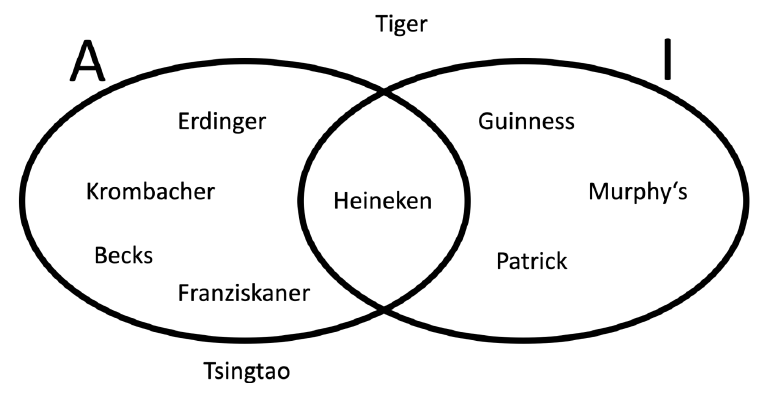

# Mengenoperationen

{{ youtube_video("https://www.youtube.com/embed/y4Eq7OQ2fMI?si=geAWLjBSakPtg8tO") }}

Für zwei Mengen $A$ und $B$ gelten folgende Operationen:

| Operation    | Symbol         | Bedeutung                                              | Sprechweise           |
|--------------|----------------|--------------------------------------------------------|-----------------------|
| Durchschnitt | $A\cap B$      | Alle Elemente, die sowohl in $A$ als auch in $B$ sind. | "$A$ geschnitten $B$" |
| Vereinigung  | $A\cup B$      | Alle Elemente, die in $A$, in $B$ oder in beiden sind. | "$A$ vereinigt $B$"   |
| Differenz    | $A\setminus B$ | Alle Elemente aus $A$, die nicht auch in $B$ sind.     | "$A$ ohne $B$"        |

Man zeichnet gerne **Venn-Diagramme**, um Mengen zu visualisieren:

_Beispiel_

In Wolfsburg gibt es die zwei Lokale "Altes Brauhaus" und den "Irish Pub".
Es werden unterschiedliche Biersorten in beiden Lokalen angeboten.

\begin{align}
&A = \{ \text{Becks, Krombacher, Heineken, Erdinger, Farnziskaner} \} \\
&I = \{ \text{Heineken, Guinnes, Patrick, Murphy's} \}
\end{align}

Außerdem gibt es in Wolfsburg zwei asiatische Biersorten, die weder in $A$ noch in $I$ erhältlich sind.
Es können nun folgende Mengenoperationen durchgeführt werden.

\begin{align}
&A \cup I = \{ \text{Becks, Krombacher, Heineken, Erdinger, Farnziskaner, Guinnes, Patrick, Murphy's} \} \\
&A \cap I = \{ \text{Heineken} \} \\
&A \setminus I = \{ \text{Becks, Krombacher, Heineken, Erdinger, Farnziskaner} \} \\
&I \setminus A = \{ \text{Guinnes, Patrick, Murphy's} \} \\
\end{align}

{{ task(file="tasks/mengenlehre/mengenoperationen_1.yaml") }}

[weiterer Aufgaben :fontawesome-solid-file-pdf:](Aufgaben_Mengenlehre_1.pdf){ .md-button .md-button--primary }
